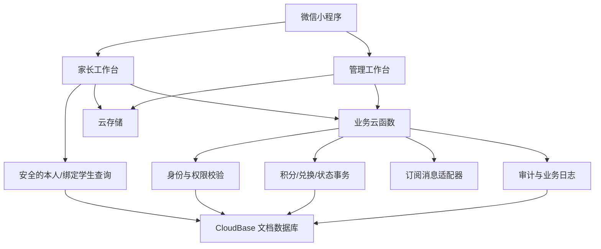
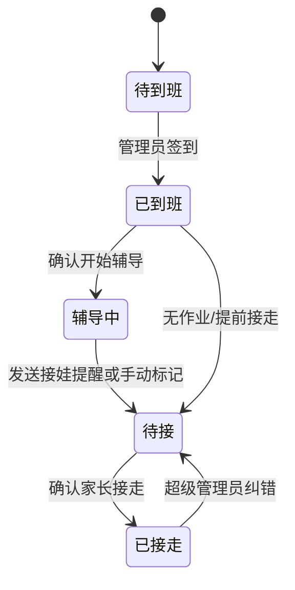
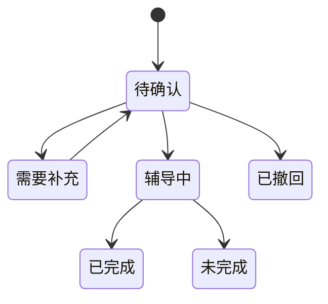
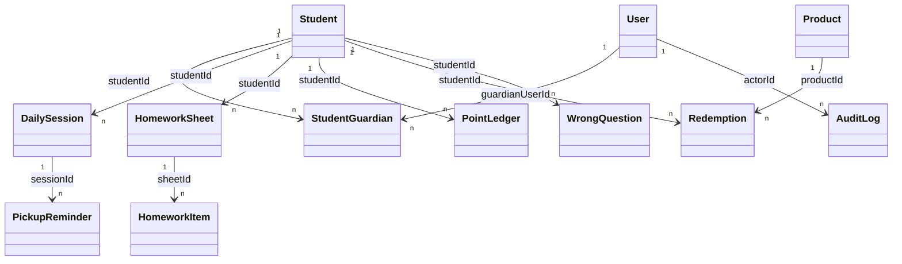

# 辅导班小程序 V1 总体设计

> 输入：`requirements.md` 1.0  
> 目标：定义可直接实施的产品结构、系统边界、数据模型、安全策略和测试策略。

## 1. 方案结论

### 1.1 产品形态

只建设一个微信小程序，通过用户角色展示不同工作台：

- 家长进入“家长工作台”。
- 老师和超级管理员进入“管理工作台”。
- 同时拥有家长和老师身份的用户，可在“我的”中切换身份。
- V1 不建设独立 Web 后台，减少登录体系、部署和维护成本。

### 1.2 技术基线

- 前端：原生微信小程序，建议 TypeScript。
- 后端：微信云开发 CloudBase。
- 身份：微信小程序原生身份，服务端使用可信 `OPENID` 映射业务用户。
- 数据：CloudBase 文档数据库。
- 文件：CloudBase 云存储，保存作业图、错题图和商品图。
- 服务端编排：CloudBase Event Functions，通过 `wx.cloud.callFunction` 调用。
- 通知：微信订阅消息适配器 + 站内提醒记录；具体模板在开发前申请并真机验证。
- 管理资源：开发前通过 CloudBase MCP/控制台创建环境、集合、权限和函数，不在客户端自动建资源。

### 1.3 关键技术边界

- 家长可安全直接读取的个人数据可以使用小程序数据库 SDK。
- 任何跨用户读取、角色授权、积分、兑换、库存、审计、状态回退都必须走云函数。
- 前端传入的 `userId`、角色、积分余额、商品价格均不可信；服务端从 `OPENID` 和数据库重新取得。
- 积分和兑换使用数据库事务；通知发送使用幂等键，防止重复点击。

## 2. 系统分层

### 2.1 前端层

- 页面只负责展示、输入校验、状态反馈和调用服务。
- 页面不自行判断管理员权限，不自行计算最终积分余额。
- 公共组件统一处理学生切换、状态标签、图片上传、空状态、确认弹窗和分页。

### 2.2 领域服务层

建议按领域组织 Event Functions，而不是一个页面一个函数：

| 服务 | 职责 |
|---|---|
| `identity-service` | 初始化用户、读取当前身份、角色切换信息 |
| `student-service` | 学生档案、绑定申请、审核、停用 |
| `homework-service` | 作业单和作业项的创建、确认、完成、反馈 |
| `session-service` | 今日辅导状态、状态回退、接走确认 |
| `notification-service` | 提醒预览、订阅消息发送、发送结果和重试 |
| `points-service` | 加分、扣分、冲正、余额重算、积分明细 |
| `leaderboard-service` | 周榜、月榜、累计成长榜聚合 |
| `store-service` | 商品、库存、兑换、撤销兑换 |
| `mistake-service` | 错题创建、更新、筛选、状态流转 |
| `admin-service` | 老师权限、系统配置、审计查询 |

实施时可以将低频服务合并部署，但代码内部仍保留领域边界。

## 3. 信息架构和页面框架

### 3.1 家长端导航

底部采用四项文字型自定义 TabBar：

1. **今日**：孩子切换、今日作业状态、预计接娃时间、最新反馈、快捷提交。
2. **作业**：提交作业、历史作业、作业详情。
3. **成长**：积分、排行榜、商品、兑换记录、错题入口。
4. **我的**：家庭成员、绑定申请、通知授权、隐私和身份切换。

#### 家长端页面清单

| 页面 | 核心内容 | 主操作 |
|---|---|---|
| 今日首页 | 当前孩子、今日状态、作业进度、提醒信息 | 提交/补充作业 |
| 提交作业 | 日期、科目、内容、照片、说明 | 保存草稿、提交 |
| 作业历史 | 日期筛选、状态筛选 | 查看详情 |
| 作业详情 | 作业项、完成时间、老师反馈、奖励 | 补充说明 |
| 成长首页 | 可用积分、本周成长、排名、最近流水 | 查看排行榜/商店 |
| 排行榜 | 周榜、月榜、累计榜、隐私说明 | 切换榜单 |
| 积分商店 | 商品、库存、所需积分 | 查看商品详情 |
| 兑换记录 | 商品快照、积分、操作时间、状态 | 查看详情 |
| 错题列表 | 科目、状态、知识点筛选 | 上传错题 |
| 错题编辑 | 图片、题目、原因、答案、状态 | 保存 |
| 家庭与绑定 | 已绑定孩子、申请状态 | 申请绑定 |
| 通知设置 | 授权状态、最近提醒 | 发起订阅授权 |

### 3.2 管理端导航

底部同样采用四项文字型自定义 TabBar：

1. **看板**：今日人数、异常、待办和快捷动作。
2. **作业**：今日作业池、学生进度、辅导反馈。
3. **学员**：学生档案、家长绑定、历史数据。
4. **管理**：积分、商品、兑换、错题、老师、设置和审计。

#### 管理端页面清单

| 页面 | 核心内容 | 主操作 |
|---|---|---|
| 今日看板 | 状态人数、未提交、未发分、待接、待审核 | 进入对应待办 |
| 今日学生列表 | 学生状态、作业进度、提醒状态 | 到班/提醒/接走 |
| 作业工作台 | 待确认、辅导中、已完成 | 批量筛选、进入详情 |
| 作业处理 | 作业项、图片、备注、反馈 | 确认、完成、结束 |
| 学生列表 | 姓名、年级、状态、积分 | 新增、筛选 |
| 学生详情 | 家长、今日状态、作业、积分、错题 | 编辑、停用 |
| 绑定审核 | 家长申请、目标学生、关系 | 通过、拒绝 |
| 积分管理 | 余额、流水、待奖励 | 发放、调整、冲正 |
| 商品管理 | 上下架、价格、库存、限兑 | 新增、编辑 |
| 现场兑换 | 学生、商品、余额、库存 | 确认兑换 |
| 兑换记录 | 状态、商品快照、操作人 | 查看、撤销 |
| 错题管理 | 学生、科目、知识点、状态 | 编辑、批量筛选 |
| 老师与权限 | 账号、角色、权限、状态 | 授权、停用 |
| 系统设置 | 积分规则、提醒预设、排行榜隐私 | 保存配置 |
| 审计日志 | 操作者、动作、对象、前后值 | 查询详情 |

## 4. UI 设计规格

### 4.1 Purpose Statement

界面同时服务忙碌家长和需要快速批量处理任务的辅导班老师。家长端强调“一眼知道孩子今天怎么样”，管理端强调“异常优先、少点击、可核对”，整体要亲切但不能幼稚。

### 4.2 Aesthetic Direction

**Organic / natural（自然手账式教育界面）**：以纸张、铅笔批注、植物色为灵感，避免常见的蓝色企业后台感；家长端更温暖，管理端在相同视觉语言下提高信息密度。

### 4.3 Color Palette

- 纸张米白 `#F7F0DF`：主背景。
- 深林绿 `#2F5B45`：主操作与关键状态。
- 陶土橙 `#D86F45`：提醒、待处理与强调。
- 墨色 `#27332D`：正文和高对比信息。
- 麦穗黄 `#F2C14E`：积分与成长反馈。

状态色不只依赖颜色，还必须同时使用文字和图标。

### 4.4 Typography

- 标题与成长数字：`霞鹜文楷` 子集字体，营造手账感。
- 正文和管理数据：`思源黑体` 子集字体，保证中文可读性。
- 字体资源在小程序中按需裁剪；若包体不允许，使用平台默认中文字体作为兼容降级，但保持字号、字重和字距令牌不变。

### 4.5 Layout Strategy

- 家长首页使用“偏左的大状态标题 + 右侧错位时间便签 + 下方时间轴”，打破对称卡片堆叠。
- 管理看板使用纵向状态轨道贯穿各待办分组，关键异常横跨内容区，不采用平均分配的宫格。
- 列表保持高扫描效率；装饰性错位仅用于首页和成长页，不干扰表单及批量操作。
- 图标统一使用同一套专业线性图标的本地资源，不使用 emoji 作为功能图标。

### 4.6 交互原则

- 高风险操作使用底部确认面板，明确展示对象、变化值和结果。
- 加积分、兑换、发送提醒按钮提交后立即进入禁用/处理中状态。
- 网络失败保留用户已输入内容，允许重试，不重复创建业务记录。
- 管理列表优先显示“为什么需要处理”，而不是只显示状态色。
- 图片上传先压缩并显示缩略图，原图仅在详情预览加载。

## 5. 核心业务状态机

### 5.1 今日辅导记录

任何逆向状态变更必须填写原因并记录审计；普通老师是否允许逆向修正由权限配置控制。

### 5.2 作业单

### 5.3 错题

`待订正 → 已订正 → 已掌握`。允许从已掌握回到待订正，表示复测再次出错；保留历史状态事件。

### 5.4 商品和兑换

- 商品：草稿 → 上架 → 下架；库存为 0 时派生显示售罄。
- 兑换：处理中 → 已完成 → 已撤销。
- “处理中”只用于事务执行和异常恢复，正常界面不应长期停留。

## 6. 数据模型

### 6.1 集合划分

| 集合 | 关键字段 | 说明 |
|---|---|---|
| `users` | openidHash, displayName, roles, status | 业务用户；OPENID 原值不返回客户端 |
| `students` | name, nickname, grade, status, pointBalance | 学生档案；余额为缓存值，可由流水重算 |
| `student_guardians` | studentId, guardianUserId, relation, status | 多对多绑定与审核状态 |
| `staff_permissions` | userId, permissions, status | 老师细粒度权限 |
| `daily_sessions` | studentId, dateKey, status, arrivalAt, pickupAt | 每日辅导状态，studentId+dateKey 唯一 |
| `homework_sheets` | studentId, dateKey, status, feedback, rewardStatus | 每日作业单 |
| `homework_items` | sheetId, subject, content, images, status | 作业单内的科目项 |
| `pickup_reminders` | sessionId, etaAt, senderId, status, idempotencyKey | 发送记录与结果 |
| `point_ledger` | studentId, delta, type, reason, sourceRef, balanceAfter | 不可删除的积分流水 |
| `products` | name, image, pointsCost, stock, status, limits | 商品当前配置 |
| `redemptions` | studentId, productSnapshot, pointsCost, status, operatorId | 兑换及商品快照 |
| `wrong_questions` | studentId, creatorId, subject, knowledgeTags, images, status | 错题主记录 |
| `wrong_question_events` | wrongQuestionId, fromStatus, toStatus, operatorId | 错题状态历史 |
| `audit_logs` | actorId, action, target, before, after, reason, requestId | 敏感操作审计 |
| `system_settings` | key, value, updatedBy | 积分、提醒、排行等配置 |

### 6.2 关系图

### 6.3 唯一键与幂等键

- `users.openidHash` 唯一。
- `daily_sessions(studentId, dateKey)` 逻辑唯一。
- `homework_sheets(studentId, dateKey, activeVersion)` 只允许一个有效版本。
- 作业奖励：`HOMEWORK_REWARD:{sheetId}:{ruleId}`。
- 提醒发送：`PICKUP_NOTICE:{sessionId}:{etaAt}`。
- 商品兑换：客户端生成 `requestId`，服务端记录并拒绝重复请求。
- 冲正：每笔原流水或原兑换最多存在一笔有效冲正。

### 6.4 索引规划

- 今日看板：`daily_sessions(dateKey, status)`。
- 学生作业：`homework_sheets(studentId, dateKey desc)`。
- 管理作业池：`homework_sheets(dateKey, status, updatedAt desc)`。
- 积分明细：`point_ledger(studentId, createdAt desc)`。
- 排行聚合：`point_ledger(createdAt, delta, studentId)`；数据量增长后增加周期汇总集合。
- 错题筛选：`wrong_questions(studentId, subject, status, updatedAt desc)`。
- 兑换记录：`redemptions(studentId, createdAt desc)` 和 `redemptions(status, createdAt desc)`。

## 7. 权限设计

### 7.1 权限代码

| 权限 | Owner | Staff 默认 |
|---|---:|---:|
| `student.read_all` | 是 | 是 |
| `student.manage` | 是 | 否 |
| `binding.review` | 是 | 否 |
| `homework.manage` | 是 | 是 |
| `session.manage` | 是 | 是 |
| `notification.send` | 是 | 是 |
| `points.grant` | 是 | 是 |
| `points.adjust` | 是 | 否 |
| `points.reverse` | 是 | 否 |
| `product.manage` | 是 | 否 |
| `redemption.create` | 是 | 是 |
| `redemption.reverse` | 是 | 否 |
| `mistake.manage_all` | 是 | 是 |
| `staff.manage` | 是 | 否 |
| `audit.read` | 是 | 否 |
| `settings.manage` | 是 | 否 |

### 7.2 服务端授权顺序

每个写操作统一执行：

1. 从微信上下文取得可信 OPENID。
2. 查询有效 `users` 记录。
3. 校验账号状态和角色。
4. 校验具体权限或家长—学生绑定。
5. 校验请求参数和当前业务状态。
6. 执行事务或写操作。
7. 写业务事件和必要的审计日志。
8. 返回不含敏感标识的结果。

## 8. 核心服务命令

| 领域 | 写命令 | 查询 |
|---|---|---|
| 身份 | initializeUser, requestBinding, reviewBinding, updateStaffAccess | getCurrentProfile, listBindings |
| 作业 | createSheet, supplementSheet, confirmSheet, updateItemStatus, finishSheet | getTodaySheet, listSheets |
| 今日状态 | ensureSession, transitionSession, correctSession | getTodayDashboard, listTodayStudents |
| 提醒 | previewPickupNotice, sendPickupNotice | listSessionNotices |
| 积分 | grantPoints, adjustPoints, reverseLedger | getBalance, listLedger |
| 排行 | 无 | getWeeklyBoard, getMonthlyBoard, getLifetimeBoard |
| 商店 | createProduct, updateProduct, changeStock, redeemProduct, reverseRedemption | listProducts, listRedemptions |
| 错题 | createWrongQuestion, updateWrongQuestion, transitionWrongQuestion | listWrongQuestions, getWrongQuestion |
| 审计 | 无普通写入口 | listAuditLogs, getAuditDetail |

统一返回结构：`requestId`、`success`、业务数据或稳定错误码。前端依据错误码显示中文提示，不直接展示内部异常栈。

## 9. 关键事务设计

### 9.1 发放积分

在同一事务内：校验权限 → 检查幂等键 → 读取学生余额 → 新增流水 → 更新余额缓存 → 标记作业奖励状态。失败则全部回滚。

### 9.2 商品兑换

在同一事务内：校验权限 → 检查 requestId → 读取商品和学生 → 校验上架/库存/余额/限兑 → 创建处理中兑换 → 扣库存 → 写负积分流水 → 更新余额 → 完成兑换。任一步失败均不留下部分扣减。

### 9.3 撤销兑换

校验 Owner 权限和未撤销状态 → 创建反向积分流水 → 恢复库存 → 更新兑换状态 → 记录审计。原记录不删除。

### 9.4 发送提醒

先创建待发送记录并占用幂等键，再调用消息能力，最后写入成功或失败结果。消息调用超时后按微信侧可查询能力处理；无法确认时标记“结果未知”，禁止无提示自动重发。

## 10. 图片和文件策略

- 路径按环境和业务隔离：`{env}/{studentId}/{module}/{yyyy}/{mm}/{uuid}`。
- 小程序上传前压缩；数据库只保存 fileId、缩略信息和业务元数据。
- 家长读取图片前必须经过学生绑定校验；不在公开页面使用永久公共链接。
- 删除业务记录时不立即删除文件，进入延迟清理队列，避免误删仍被引用的图片。
- 商品图片和用户作业图片使用不同目录和权限策略。

## 11. 通知设计

- 消息模板字段只包含必要信息：孩子昵称、预计可接时间、辅导班提示语。
- 家长在通知设置或关键流程中主动申请订阅授权。
- 发送前显示预计时刻和接收人；多家长绑定时由管理员选择主要联系人或全部已授权联系人。
- 站内保留最近提醒，即使微信消息失败，管理端仍能看到失败原因。
- V1 不承诺后台定时器到点再发；点击时直接发送“预计 XX:XX 可接”。

## 12. 排行榜计算

- `periodScore = 周期内 delta > 0 的有效流水合计`。
- 排除被冲正的原始正向流水，纳入有效的反向结果。
- 兑换扣分不参与 periodScore。
- 返回前再次应用学生公开排行设置和姓名脱敏。
- V1 可实时聚合；当单月流水达到预设阈值后，改用 `leaderboard_snapshots` 周期汇总集合。

## 13. 错误处理与可观测性

### 13.1 稳定错误码

- `UNAUTHENTICATED`：用户身份初始化失败。
- `FORBIDDEN`：无角色或业务数据权限。
- `INVALID_STATE`：当前状态不允许该操作。
- `DUPLICATE_REQUEST`：幂等请求已处理。
- `INSUFFICIENT_POINTS`：积分不足。
- `OUT_OF_STOCK`：库存不足。
- `NOTICE_PERMISSION_REQUIRED`：缺少订阅授权。
- `CONFLICT`：数据已被其他管理员更新。

### 13.2 日志

- 所有云函数记录 requestId、函数、动作、actorId、耗时、结果码，不记录原始 OPENID 和作业图片内容。
- 积分、兑换、权限和通知错误单独统计。
- 上线后重点观察通知失败率、重复请求拦截数、事务冲突率和列表慢查询。

## 14. 测试策略

### 14.1 单元测试

- 状态机合法/非法转换。
- 积分计算、冲正、负余额防护。
- 排行周期边界和兑换不降排名。
- 商品库存、限兑和商品快照。
- 姓名脱敏、权限判断和错误码映射。

### 14.2 集成测试

- OPENID → 用户 → 角色/绑定的完整授权链。
- 积分事务、兑换事务、撤销事务。
- 消息成功、失败、超时和重复发送。
- 图片上传、引用和无权限访问。

### 14.3 真机验收

- 家长、Staff、Owner 三类账号。
- iOS 和 Android 各至少一台。
- 弱网、重复点击、切后台再回来、订阅消息拒绝授权。
- 从提交作业到确认接走的完整一天模拟。

## 15. 发布与环境

- `dev`：开发环境，使用测试学生和测试商品。
- `staging`：体验版验收环境，模拟真实角色和通知模板。
- `prod`：生产环境，禁止测试脚本写入。
- 所有代码和配置显式使用完整 EnvId；不依赖本地默认环境。
- 发布顺序：创建后端资源 → 部署云函数 → 配置权限和消息模板 → 配置前端 EnvId → 开发者工具预览 → 真机验收 → 上传体验版 → 提交审核。
- 正式发布前执行 CloudBase 代码审查、静态检查、构建测试和运行时主流程验证。

## 16. 备份和恢复

- 每日导出学生、绑定、积分、兑换和商品关键数据；图片依赖云存储版本和业务引用。
- 每周执行一次“流水重算余额”只读核对，发现差异立即告警，不自动覆盖。
- 提供 Owner 可见的数据导出能力作为后续增强；V1 先保留后台运维脚本方案。
- 删除策略以逻辑停用为主；审计、积分和兑换永久保留在业务生命周期内。
